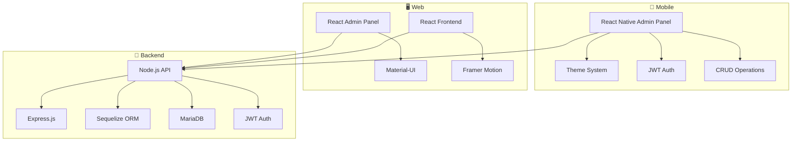

# 🚀 CodeFjord Admin Panel

> **Moderne Full-Stack Webseiten-Lösung mit React Native Admin Panel, CMS-Backend und React Frontend**

[](https://reactnative.dev/)
[](https://www.typescriptlang.org/)
[](https://nodejs.org/)
[](https://mariadb.org/)
[](LICENSE)

<div align="center">


**Entwickelt mit ❤️ von CodeFjord**

[📱 Features](#-features) • [🏗️ Architektur](#️-architektur) • [🚀 Quick Start](#-quick-start) • [📖 Dokumentation](#-dokumentation) • [🤝 Contributing](#-contributing)

</div>

---

## 📱 Features

### 🎨 **React Native Admin Panel**

- **📱 Native iOS App** mit Ad-Hoc Distribution
- **🌙 Dark/Light/System Theme** mit automatischer Erkennung
- **🔐 JWT Authentifizierung** mit Zustand State Management
- **📊 Echtzeit Dashboard** mit Pull-to-Refresh
- **📝 CRUD Operationen** für alle Content-Typen
- **📸 Media Management** mit Upload-Funktionalität
- **🔔 Push Notifications** Integration

### 🖥️ **React Web Admin Panel**

- **⚡ Vite Build System** für optimale Performance
- **🎨 Material-UI Design System**
- **📱 Responsive Design** für alle Geräte
- **🔐 Rollenbasierte Berechtigungen**
- **📊 Analytics Dashboard**
- **📝 WYSIWYG Editor**

### 🌐 **React Frontend**

- **⚡ Moderne Performance** mit Code-Splitting
- **🎭 Framer Motion Animationen**
- **🔍 SEO-optimiert** mit Meta-Tags
- **📱 Mobile-First Design**
- **🎨 TailwindCSS Styling**

### 🔧 **Node.js Backend**

- **🚀 Express.js API** mit ES Modules
- **🗄️ MariaDB** mit Sequelize ORM
- **🔐 JWT Authentication** mit bcrypt
- **📧 E-Mail Integration** (Nodemailer)
- **📁 File Upload** mit Multer
- **✅ Input Validation** mit Express-validator

---

## 🏗️ Architektur



### 📁 Projektstruktur

```
CodeFjord Webseite/
├── 📱 ios/CodeFjordAdmin/          # React Native Admin Panel
│   ├── src/
│   │   ├── screens/                # App Screens
│   │   ├── components/             # Reusable Components
│   │   ├── store/                  # Zustand State Management
│   │   ├── api/                    # API Client
│   │   └── theme/                  # Theme Configuration
│   └── scripts/                    # Build & Deploy Scripts
├── 🖥️ admin-panel/                 # React Web Admin Panel
│   ├── src/
│   │   ├── pages/                  # Admin Pages
│   │   ├── components/             # UI Components
│   │   └── api/                    # API Integration
├── 🌐 frontend/                    # React Frontend Website
│   ├── src/
│   │   ├── pages/                  # Public Pages
│   │   ├── components/             # UI Components
│   │   └── assets/                 # Images & Icons
├── 🔧 cms-backend/                 # Node.js API Server
│   ├── controllers/                # API Controllers
│   ├── models/                     # Database Models
│   ├── routes/                     # API Routes
│   └── middleware/                 # Auth & Validation
└── 📚 docs/                        # Documentation
```

---

## 🚀 Quick Start

### 📋 Voraussetzungen

- **Node.js** 18+ ([Download](https://nodejs.org/))
- **MariaDB/MySQL** Server
- **Xcode** (für iOS Development)
- **Git**

### ⚡ Installation

```bash
# 1. Repository klonen
git clone https://github.com/codefjord/webseite.git
cd webseite

# 2. Backend Setup
cd cms-backend
npm install
cp .env.example .env
# .env konfigurieren
npm start

# 3. Web Admin Panel
cd ../admin-panel
npm install
npm run dev

# 4. Frontend
cd ../frontend
npm install
npm run dev

# 5. React Native Admin Panel
cd ../ios/CodeFjordAdmin
npm install
npx react-native run-ios
```

### 🔧 Umgebungsvariablen

```env
# Backend (.env)
PORT=4444
DB_HOST=localhost
DB_NAME=codefjord_cms
DB_USER=your_username
DB_PASSWORD=your_password
JWT_SECRET=your_secret_key

# E-Mail (optional)
SMTP_HOST=smtp.gmail.com
SMTP_USER=your_email@gmail.com
SMTP_PASS=your_app_password
```

---

## 📖 Dokumentation

### 🔐 Authentifizierung

```typescript
// JWT Token Management
const { login, logout, user } = useAuthStore();

// Login
await login(email, password);

// Check Auth Status
if (user) {
  // User is authenticated
}
```

### 🎨 Theme System

```typescript
// Theme Management
const { mode, setMode, getCurrentTheme } = useThemeStore();

// Available modes: 'light' | 'dark' | 'system'
setMode("system"); // Automatically follows system theme
```

### 📊 API Integration

```typescript
// CRUD Operations
const { getAll, create, update, delete } = usePortfolioStore();

// Fetch all items
const portfolios = await getAll();

// Create new item
await create({ title: 'New Project', description: '...' });
```

### 📱 React Native Features

- **Ad-Hoc Distribution**: QR-Code Download für iOS
- **Theme Switching**: Light/Dark/System mit automatischer Erkennung
- **Pull-to-Refresh**: Echtzeit-Datenaktualisierung
- **Offline Support**: Cached Daten mit Offline-Indikator

---

## 🛠️ Development

### 📝 Code Style

```bash
# ESLint & Prettier
npm run lint
npm run format

# TypeScript Check
npx tsc --noEmit
```

### 🧪 Testing

```bash
# Unit Tests
npm test

# E2E Tests (Cypress)
npm run cypress:open
```

### 🚀 Build & Deploy

```bash
# React Native iOS Build
cd ios/CodeFjordAdmin
npm run build:ios

# Web Build
npm run build

# Ad-Hoc Distribution
npm run deploy:adhoc
```

---

## 📊 API Endpoints

| Method   | Endpoint             | Description      |
| -------- | -------------------- | ---------------- |
| `POST`   | `/api/auth/login`    | User Login       |
| `GET`    | `/api/auth/me`       | Current User     |
| `GET`    | `/api/portfolio`     | Portfolio Items  |
| `POST`   | `/api/portfolio`     | Create Portfolio |
| `PUT`    | `/api/portfolio/:id` | Update Portfolio |
| `DELETE` | `/api/portfolio/:id` | Delete Portfolio |
| `GET`    | `/api/blog`          | Blog Posts       |
| `GET`    | `/api/team-members`  | Team Members     |
| `GET`    | `/api/pages`         | Static Pages     |

---

## 🔒 Sicherheit

- ✅ **JWT Authentication** mit bcrypt Hashing
- ✅ **CORS Protection** konfiguriert
- ✅ **Input Validation** mit Express-validator
- ✅ **SQL Injection Protection** durch Sequelize
- ✅ **Rate Limiting** implementiert
- ✅ **HTTPS** in Produktion

---

## 🚀 Deployment

### 🌐 Production URLs

- **Frontend**: https://code-fjord.de
- **Admin Panel**: https://admin.code-fjord.de
- **API**: https://api.code-fjord.de

### 📱 iOS Ad-Hoc Distribution

```bash
# Build & Deploy
cd ios/CodeFjordAdmin
npm run deploy:adhoc

# QR-Code wird generiert für einfachen Download
```

### 🔄 CI/CD Pipeline

- **Staging**: Auto-deploy auf `develop` branch
- **Production**: Auto-deploy auf `main` branch
- **Testing**: Automatische Tests vor Deployment
- **Notifications**: Discord & E-Mail Alerts

---

## 🤝 Contributing

Wir freuen uns über Beiträge! Hier ist unser Workflow:

1. **Fork** das Repository
2. **Branch** erstellen (`git checkout -b feature/amazing-feature`)
3. **Commit** deine Änderungen (`git commit -m 'Add amazing feature'`)
4. **Push** zum Branch (`git push origin feature/amazing-feature`)
5. **Pull Request** erstellen

### 📋 Development Guidelines

- **TypeScript** für alle neuen Features
- **ESLint** & **Prettier** für Code Style
- **Tests** für neue Funktionen
- **Dokumentation** für API-Änderungen

---

## 📞 Support

- **📧 Email**: support@code-fjord.de
- **💬 Discord**: [CodeFjord Community](https://discord.gg/codefjord)
- **🐛 Issues**: [GitHub Issues](https://github.com/codefjord/webseite/issues)
- **📖 Docs**: [Documentation](https://docs.code-fjord.de)

---

## 📄 Lizenz

Dieses Projekt ist **proprietär** und gehört zu **CodeFjord**. Alle Rechte vorbehalten.

---

<div align="center">

**Entwickelt mit ❤️ von [CodeFjord](https://code-fjord.de)**

[](https://code-fjord.de)

_Letzte Aktualisierung: Juli 2025 | Version: 1.0.0_

</div>
